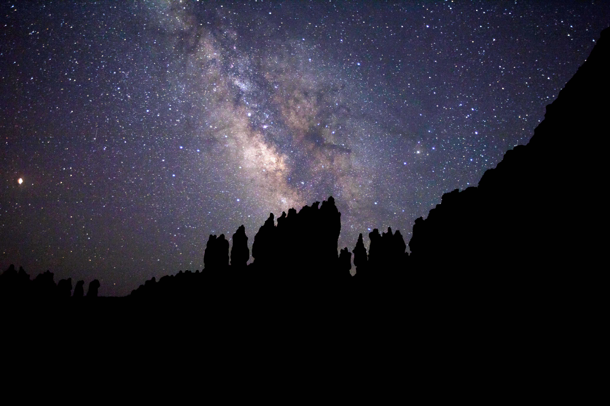

# Project Dark Sky

Image Source: [darksky.org](https://www.darksky.org/bryce-canyon-national-park-certified-as-an-international-dark-sky-park/) 
Photo Credit: Keith Moore

## Scope
The goal of Project Dark Sky is to discover the darkest sky among the US National Parks. In conjunction with light pollution, we sought to investigate trends in atmospheric conditions (air pollution, cloud cover) with the potential to lessen a dark sky experience. By identifying the park with the best limiting magnitude, air quality index and lowest cloud cover, we aim to discover the National Park with the greatest potential for a dark sky experience.

### Background
**Light pollution** is the result of misdirected artificial light. It is responsible for adverse health effects, wasted energy consumption and disrupting ecosystems. Light pollution reduces the **Limiting Magnitude** or the ability of the naked eye to detect faint stars. Simply put, the higher the Limiting Magnitude, the better the stargazing. 83% of the word's population lives under light-polluted skies.2 

**Air Quality Index**
Pollutants include fine particles, black carbon and ground level ozone. These combinations compose air pollution resulting in scattered light and in humid conditions a haze emerges. Haze is responsible for reduced visibility.4 89% of National Parks suffer from haze pollution.7 While colorless, an increase in ground level ozone suggests that pollution is the cause for reduced visibility as it facilitates chemical reactions that produce haze forming particles.4 [Ratings for ground level ozone](images/aqi.png)

**Cloud cover** or cloudiness is the amount of sky that is covered by cloud expressed as a percentage. The cloud coverage is for all altitudes. Due to the reflective nature, clouds amplify the effect of light pollution.5

### Impact of Light Pollution
The effects of light pollution have been described at length, the following sources are recommended for further reading: 

1.[Saving the Dark - What is Light Pollution](http://savingthedark.com/light-pollution-1)\
2.[National Geographic - Our nights are getting brighter, and Earth is paying the price](https://www.nationalgeographic.com/science/2019/04/nights-are-getting-brighter-earth-paying-the-price-light-pollution-dark-skies/)\
3.[The Scientist - The Vanishing Night: Light Pollution Threatens Ecosystems](https://www.the-scientist.com/features/the-vanishing-night--light-pollution-threatens-ecosystems-64803)\

## Strategy

**Coordinates for US National Parks**
First, we obtained GPS coordinates for all of the US National Parks with [Google Places Search API](https://developers.google.com/places/web-service/search).

**Limiting Magnitude**
[Globe at Night](https://www.datastro.eu/explore/dataset/imageserver/information/?disjunctive.limitingmag&disjunctive.cloudcover&disjunctive.constellation&disjunctive.country&sort=utdate) contains daily Limiting Magnitude and coordinates from voluntary users all over the world. The API does not permit query by coordinates, hence for our purposes all reported data was obtained and subsequently filtered with the park coordinates.

“Limiting Mag API Call” notebook calls the Globe at Night API. The payload reflects the instructions within the API to properly call it. We then dump the returns to jsons for each individual state (again due to limitations of the API and how to call it for each individual state). The exception was required because there was a problem within the API that prevents calls for the state of West Virginia. Without the exception, the code terminated at West Virginia, resulting in loss of data for West Virginia, Wisconsin and Wyoming. Each individual json is then compiled into a dataframe in the “States to DF” notebook. Latitude and Longitude data were split as the API provides a list of coordinates. The final dataframe was exported to a CSV.

Notes: Some parks have no user-reported data available and were excluded as a result.

**Air Quality Index - Ground Level Ozone**
[Environmental Protection Agency](https://aqs.epa.gov/aqsweb/documents/data_api.html#annual) has monitoring centers located inside National Parks in addition to representative sites. The query provides data on daily ground level ozone by each year. The Annual Summary Data By Box permits query by park coordindates with a range of 30 miles or +/-0.44 degrees of latitude and longtitude. 

We downloaded the annual summary air quality dataset for 2015, 2016, 2017, 2018, and 2019. Note that, at first, we tried to get raw data by making API calls but that did not work in the end because number of calls exceeded the daily limit). Some National Parks have neither in-park monitoring or nearby representative sites and were excluded as a result.

**Cloud Cover**
[Visual Crossing Weather](https://rapidapi.com/awigmore/api/visual-crossing-weather) through Rapid API offers daily historical weather by coordinates or City, State. Query by coordinates returned incomplete for the desired date range, however query by City, State provided complete results for the years 2015-2019. To determine the nearest city with the park coordinate, [CityPy](https://pypi.org/project/citipy/) was implemented. The corresponding City, State was then used to query Visual Crossing Weather. If a match is not found, Visual Crossing Weather searches a default radius up to 50,000 meters (equivalent to 30miles) within the specified location. The output data is a comma separated table format. The API has a rate-limit in effect, upon execution of the for loop, approximately 40 locations were returned. A second request must be carried out to complete the remaining list of City, State corresponding to parks. 

Notes: 
Two National Parks had no reported weather data and were excluded as a result. The entire radius difference is unknown with the use of CityPy. However, to complete the final merge of cloud cover and ground level ozone, coordinates within 30 miles of the national park coordinates were applied.

**Compilation**
Data was cleaned to attain consist coordinates across the dates, limiting magnitude, cloud cover, and pollution in notebooks titled after the “item being measured Cleaning”. The exported CSVs were cross joined with the Google Places Search API list of National Park coordinates. Criteria to successfully match datasets must reside within 30 miles (.44 degrees of latitude and longitude) of the National Park. Any readings (ex. -9999 for limiting magnitude) outside of field range (0-10) were removed. Dates were converted to the datetime format and inapplicable columns were dropped. Data was converted to a pivot table to report the mean of the measure by year compared by date and park. This data was exported to CSV.

## Analysis
Charting Limiting Magnitude was accomplished with a for loop over each park by year using the pivot table. The available data on Limiting Magnitude in US National Parks posed a difficult challenge due to wide ranges in the number of reported measurements per park. These plots assisted in visualizing how irreconcilable the data was (too few measurements for many parks to use; no discernible trends). **Ultimately, we determined the limiting magnitude data to be inconclusive.** For ease of reference, plots are available in [Supplemental_Figures](Supplemental_Figures/). 

**Next, we focused on identifying any trends between ground level ozone and cloud cover for each park.**

For the years 2015-2019, Mean Ground Level Ozone and Mean Cloud Cover vs. Time (Years) were charted for each park.

[INSERT REPRESENTATIVE PLOTS HERE]

**The following packages were used in this project:** citipy, matplotlib, pandas, numpy, sqlalchemy.

## Conservation Measures
The International Dark Sky Places (IDSP) Program was founded to encourage communities, parks and protected areas around the world to preserve and protect dark sites through responsible lighting polices and public education.
The time from initial inquiry to formal designation **averages 1-3 years.**6

The National Parks Conservation Association (NPCA) is an independent, nonpartisan membership organization that advocates for the National Parks System. Their mission is "to protect and enhance America's National Park System for present and future generations."7

## Dark Sky Tourism or Astrotourism
The rise of astrotourism boasts economical incentives for communities with the Dark Sky designation. As public awareness and interest grows, the benefits of responsible astrotourism have a demonstrable impact to reducing the carbon footprint, increasing the health of the ecosystem and environment for future generations to cherish.8

### Additional References:
4.[National Park Service Air Pollution & Visibility](https://www.nps.gov/subjects/air/visibility.htm)\
5.[Christopher C. M. Kyba, Thomas Ruhtz, Jürgen Fischer, Franz Hölker PLoS One. 2011; 6(3): e17307 Cloud Coverage Acts as an Amplifier for Ecological Light Pollution in Urban Ecosystems](https://www.ncbi.nlm.nih.gov/pmc/articles/PMC3047560/)\
6.[darksky.org](https://www.darksky.org/)\
7.[National Parks Conservation Association](https://www.npca.org/reports/air-climate-report)\
8.[Laeticia Jacobs, Elizabeth A. Du Preez & Felicité Fairer-Wessels (2019) To wish upon a star: Exploring Astro Tourism as vehicle for sustainable rural development, Development Southern Africa, DOI: 10.1080/0376835X.2019.1609908](https://doi.org/10.1080/0376835X.2019.1609908)\
9.[US Forest Service](https://www.fsvisimages.com/visdata.aspx)\